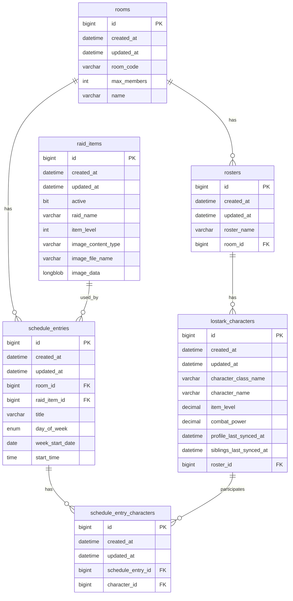

# LostArk Scheduler ERD

## 1. 전체 개요

이 ERD는 로스트아크 레이드 스케줄러 서비스를 위한 데이터베이스 구조이다.

주요 개념은 다음과 같다.

- `rooms`: 스케줄러 방
- `rosters`: 방 안의 원정대 또는 그룹
- `lostark_characters`: 로스트아크 캐릭터
- `raid_items`: 등록 가능한 레이드 정보
- `schedule_entries`: 요일별 레이드 스케줄
- `schedule_entry_characters`: 스케줄에 참여하는 캐릭터 매핑 테이블

---

## 2. 테이블 구조

## 2.1 rooms

스케줄러 방 정보를 저장하는 테이블이다.

| 컬럼명      | 타입        | 설명           |
| ----------- | ----------- | -------------- |
| id          | bigint      | PK             |
| created_at  | datetime(6) | 생성일         |
| updated_at  | datetime(6) | 수정일         |
| room_code   | varchar(6)  | 방 코드        |
| max_members | int         | 최대 참여 인원 |
| name        | varchar(80) | 방 이름        |

### 역할

- 사용자가 방 코드를 통해 입장하는 스케줄러 방을 의미한다.
- 하나의 방은 여러 개의 원정대 그룹과 스케줄을 가질 수 있다.

---

## 2.2 rosters

방 안에서 캐릭터를 묶는 원정대 또는 그룹 정보를 저장하는 테이블이다.

| 컬럼명      | 타입        | 설명                  |
| ----------- | ----------- | --------------------- |
| id          | bigint      | PK                    |
| created_at  | datetime(6) | 생성일                |
| updated_at  | datetime(6) | 수정일                |
| roster_name | varchar(50) | 원정대 또는 그룹 이름 |
| room_id     | bigint      | FK, rooms.id          |

### 관계

- `rooms 1 : N rosters`
- 하나의 방에는 여러 개의 roster가 존재할 수 있다.

---

## 2.3 lostark_characters

로스트아크 캐릭터 정보를 저장하는 테이블이다.

| 컬럼명                  | 타입          | 설명                             |
| ----------------------- | ------------- | -------------------------------- |
| id                      | bigint        | PK                               |
| created_at              | datetime(6)   | 생성일                           |
| updated_at              | datetime(6)   | 수정일                           |
| character_class_name    | varchar(40)   | 캐릭터 클래스명                  |
| character_name          | varchar(50)   | 캐릭터명                         |
| item_level              | decimal(8,2)  | 아이템 레벨                      |
| combat_power            | decimal(14,2) | 전투력                           |
| profile_last_synced_at  | datetime(6)   | 프로필 마지막 동기화 일시        |
| siblings_last_synced_at | datetime(6)   | 원정대 캐릭터 마지막 동기화 일시 |
| roster_id               | bigint        | FK, rosters.id                   |

### 관계

- `rosters 1 : N lostark_characters`
- 하나의 roster에는 여러 캐릭터가 포함될 수 있다.

---

## 2.4 raid_items

레이드 기본 정보를 저장하는 테이블이다.

| 컬럼명             | 타입         | 설명                       |
| ------------------ | ------------ | -------------------------- |
| id                 | bigint       | PK                         |
| created_at         | datetime(6)  | 생성일                     |
| updated_at         | datetime(6)  | 수정일                     |
| active             | bit(1)       | 사용 여부                  |
| raid_name          | varchar(80)  | 레이드 이름                |
| item_level         | int          | 입장 또는 권장 아이템 레벨 |
| image_content_type | varchar(100) | 이미지 MIME 타입           |
| image_file_name    | varchar(255) | 이미지 파일명              |
| image_data         | longblob     | 이미지 바이너리 데이터     |

### 역할

- 스케줄에 추가할 수 있는 레이드 목록을 관리한다.
- 예: 카멘, 에키드나, 베히모스, 카제로스 레이드 등

---

## 2.5 schedule_entries

방 안의 요일별 레이드 스케줄을 저장하는 테이블이다.

| 컬럼명          | 타입         | 설명              |
| --------------- | ------------ | ----------------- |
| id              | bigint       | PK                |
| created_at      | datetime(6)  | 생성일            |
| updated_at      | datetime(6)  | 수정일            |
| room_id         | bigint       | FK, rooms.id      |
| raid_item_id    | bigint       | FK, raid_items.id |
| title           | varchar(120) | 스케줄 제목       |
| day_of_week     | enum         | 요일              |
| week_start_date | date         | 해당 주 시작일    |
| start_time      | time         | 시작 시간         |

### day_of_week 값

```text
monday
tuesday
wednesday
thursday
friday
saturday
sunday
```

### 관계

- `rooms 1 : N schedule_entries`
- `raid_items 1 : N schedule_entries`
- 하나의 방에는 여러 레이드 스케줄이 등록될 수 있다.
- 하나의 레이드 항목은 여러 스케줄에서 재사용될 수 있다.

---

## 2.6 schedule_entry_characters

레이드 스케줄과 참여 캐릭터를 연결하는 매핑 테이블이다.

| 컬럼명            | 타입        | 설명                      |
| ----------------- | ----------- | ------------------------- |
| id                | bigint      | PK                        |
| created_at        | datetime(6) | 생성일                    |
| updated_at        | datetime(6) | 수정일                    |
| schedule_entry_id | bigint      | FK, schedule_entries.id   |
| character_id      | bigint      | FK, lostark_characters.id |

### 관계

- `schedule_entries 1 : N schedule_entry_characters`
- `lostark_characters 1 : N schedule_entry_characters`
- 하나의 스케줄에는 여러 캐릭터가 참여할 수 있다.
- 하나의 캐릭터는 여러 스케줄에 참여할 수 있다.
- 결과적으로 `schedule_entries`와 `lostark_characters`는 N:M 관계이다.

---

# 3. 관계 요약

```text
rooms
  1:N rosters
  1:N schedule_entries

rosters
  N:1 rooms
  1:N lostark_characters

lostark_characters
  N:1 rosters
  1:N schedule_entry_characters

raid_items
  1:N schedule_entries

schedule_entries
  N:1 rooms
  N:1 raid_items
  1:N schedule_entry_characters

schedule_entry_characters
  N:1 schedule_entries
  N:1 lostark_characters
```

---

# 4. Mermaid ERD



---

# 5. AI 설명용 요약

이 데이터베이스는 방 코드 기반 로스트아크 레이드 스케줄러를 위한 구조이다.

사용자는 `rooms` 테이블의 방 코드를 통해 특정 스케줄러 방에 입장한다.
각 방에는 여러 개의 `rosters`가 존재할 수 있으며, roster는 원정대 또는 캐릭터 그룹 역할을 한다.

`lostark_characters`는 각 roster에 속한 캐릭터 정보를 저장한다.
캐릭터는 캐릭터명, 클래스명, 아이템 레벨, 전투력 등의 정보를 가진다.

`raid_items`는 스케줄에 등록할 수 있는 레이드 기본 정보를 저장한다.
레이드명, 입장 아이템 레벨, 이미지 정보, 사용 여부 등을 관리한다.

`schedule_entries`는 실제 요일별 레이드 스케줄이다.
각 스케줄은 특정 방에 속하며, 특정 레이드 항목을 참조한다.
요일, 주 시작일, 시작 시간, 제목 정보를 가진다.

`schedule_entry_characters`는 특정 레이드 스케줄에 어떤 캐릭터들이 참여하는지를 나타내는 매핑 테이블이다.
이를 통해 하나의 스케줄에 여러 캐릭터가 참여할 수 있고, 하나의 캐릭터도 여러 스케줄에 참여할 수 있다.
